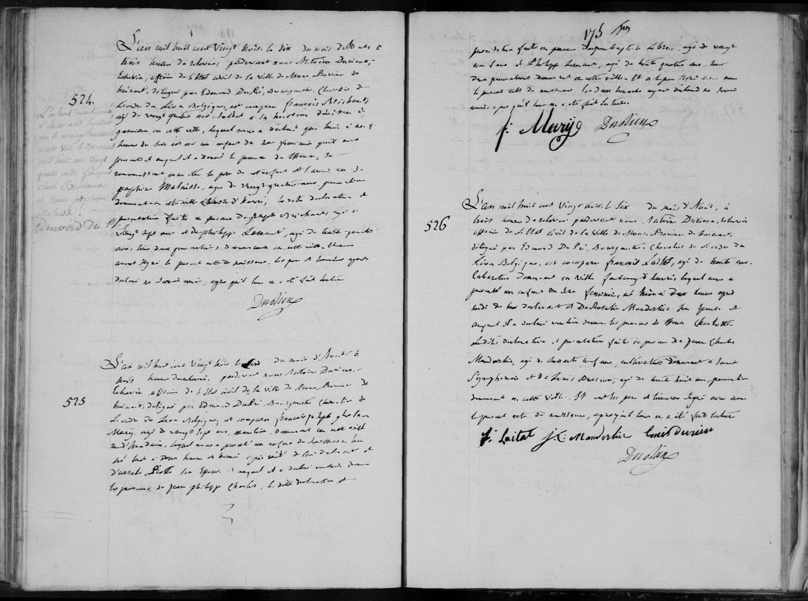

# Naissance de Philippe Mary (1823)

L'an mil huit cent vingt trois, le vingt cinquième jour du mois de mars, à onze heures du matin, devant nous, Bourgmestre, officier de l'état civil de la ville de Mons, est comparu François Joseph Ghislain Mary, âgé de vingt six ans, caunier, demeurant en cette ville, rue de la Clef, lequel nous a présenté un enfant du sexe masculin, né ce matin à trois heures, de lui déclarant et d'Ursule Joseph Piette, son épouse, et auquel il a déclaré vouloir donner les prénoms de Philippe Joseph. Lesdites déclaration et présentation faites en présence de... [noms des témoins], lesquels ont signé avec nous le présent acte après lecture faite.

---

### Tableau récapitulatif : Naissance de Philippe Joseph Mary

| Nom | Rôle dans l'acte | Occupation / Notes |
| :--- | :--- | :--- |
| Philippe Joseph Mary | Enfant (naissance) | Né le 25/03/1823 à 3h du matin |
| François Joseph Ghislain Mary | Père | 26 ans, caunier, domicilié rue de la Clef |
| Ursule Joseph Piette | Mère | Épouse de François Joseph Mary |

Un caunier était un ouvrier ou un artisan qui travaillait dans l'exploitation de la chaux. Ses tâches pouvaient inclure :

 -   L'extraction : L'extraction de la pierre calcaire nécessaire à la fabrication de la chaux.

  -  La fabrication : La cuisson de cette pierre dans un four à chaux (on le rapproche souvent des termes chaufournier ou chaussunier).

  -  La préparation et le commerce : La mise en sac et la vente de la chaux vive ou éteinte, qui était un matériau de construction absolument essentiel à l'époque pour réaliser le mortier (utilisé pour monter les murs) ou pour blanchir les façades et les murs intérieurs des maisons.