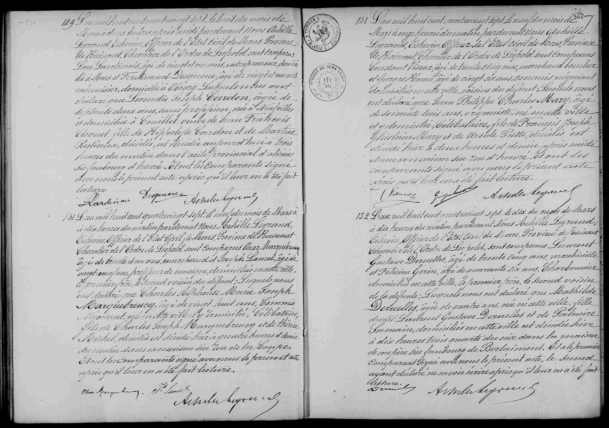

### Transcription de l'acte n° 131

L'an mil huit cent quatre-vingt-sept, le neuf du mois de Mars à onze heures du matin pardevant nous Achille Legrand, Echevin, Officier de l'Etat civil de Mons, Province de Hainaut, Chevalier de l'Ordre de Léopold sont comparus Constant Viseur agé de trente cinq ans, marchand boucher et Georges Honon agé de vingt six ans, Commis négociant domiciliés en cette ville, voisins du défunt; Lesquels nous ont déclaré que Jean Philippe Charles Mary, agé de soixante trois ans, organiste, né en cette ville et y domicilié, célibataire, fils de François Joseph Ghislain Mary et de Ursule Piette, décédés est décédé hier à deux heures et demie après midi dans sa maison sise rue d'Havré. Et ont les comparants signé avec nous le présent acte après qu'il leur en a été fait lecture.

---

### Tableau récapitulatif : Acte n° 131 (Décès de Jean Philippe Charles Mary)

| Nom | Rôle dans l'acte | Occupation / Notes |
| :--- | :--- | :--- |
| Jean Philippe Charles Mary | Défunt | 63 ans, organiste, célibataire, né/domicilié à Mons |
| François Joseph Ghislain Mary | Père du défunt | Décédé |
| Ursule Piette | Mère du défunt | Décédée |
| Constant Viseur | Déclarant | 35 ans, marchand boucher, voisin |
| Georges Honon | Déclarant | 26 ans, commis négociant, voisin |
| Achille Legrand | Officier d'état civil | Échevin de Mons |

---

### Dates et Lieux

* **Date de l'acte :** 9 mars 1887
* **Date du décès :** 8 mars 1887 (décédé "hier")
* **Adresse du décès :** Rue d'Havré, Mons

--- 

### Tableau récapitulatif : Acte n° 129

| Nom | Rôle dans l'acte | Occupation / Notes |
| :--- | :--- | :--- |
| Maria Vanhellemont | Défunte | 79 ans, née à Mons, domiciliée rue de la Petite Guirlande |
| Jean Vanhellemont | Père de la défunte | Décédé |
| Marie Joseph | Mère de la défunte | Décédée |
| Désiré Desruelles | Déclarant | 54 ans, employé, voisin |
| Henri Lejeune | Déclarant | 33 ans, commis, voisin |

---

### Tableau récapitulatif : Acte n° 130

| Nom | Rôle dans l'acte | Occupation / Notes |
| :--- | :--- | :--- |
| Jean Baptiste Joseph Carlier | Défunt | 66 ans, rentier, né à Mons, domicilié rue des Fripiers |
| Jean Baptiste Carlier | Père du défunt | Décédé |
| Marie Joseph Baudoux | Mère du défunt | Décédée |
| Jules Carlier | Déclarant | 31 ans, employé, fils du défunt |
| Pierre Joseph Derbaix | Déclarant | 48 ans, rentier, ami du défunt |

---

### Tableau récapitulatif : Acte n° 132

| Nom | Rôle dans l'acte | Occupation / Notes |
| :--- | :--- | :--- |
| Marie Catherine Ghislaine Lison | Défunte | 44 ans, ménagère, née à Mons, domiciliée rue de la Chaussée |
| Jean Baptiste Lison | Père de la défunte | Décédé |
| Marie Joseph Ghislaine Petit | Mère de la défunte | Décédée |
| Henri Hubert | Déclarant | 45 ans, cabaretier, époux de la défunte |
| Eugène Petit | Déclarant | 38 ans, facteur des postes, cousin de la défunte |