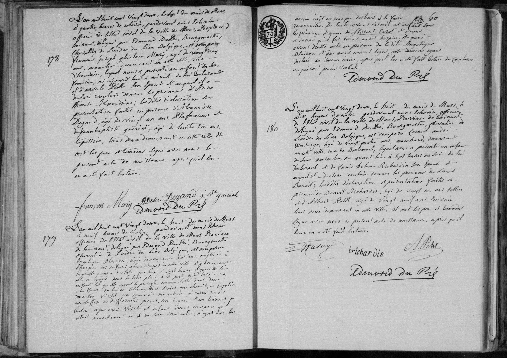

# Naissance d'Anne Thérese Alexandrine Mary (1822)

n° 178 ()

L'an mil huit cent vingt deux, le sept du mois de Mars, à quatre heures de relevée, pardevant nous, échevin, officier de l'état civil de la ville de Mons, Province de Hainaut, délégué par Edmond Dupré, Bourgmestre, Chevalier de l'Ordre du Lion Belgique, est comparu François Joseph Ghislain Mary, agé de vingt cinq ans, caunier, demeurant en cette ville, rue de Houdain, lequel nous a présenté un enfant du sexe féminin, né aujourd'hui à neuf heures du soir, de lui déclarant et d'Ursule Piette, son épouse, et auquel il a déclaré vouloir donner les prénoms d'Anne Thérese Alexandrine; lesdites déclaration et présentation faites en présence d'Alexandre Degand, agé de vingt un ans, plafonneur et de Jean Baptiste Guériat, agé de trente six ans, tapissier, tous deux demeurant en cette ville, et ont les père, témoins signé avec nous le présent acte de naissance, après qu'il leur en a été fait lecture.

---

### Tableau récapitulatif : Acte n° 178

| Nom | Rôle dans l'acte | Occupation / Notes |
| :--- | :--- | :--- |
| Anne Thérese Alexandrine Mary | Enfant (naissance) | Née le 07/03/1822 |
| François Joseph Ghislain Mary | Père | 25 ans, caunier, rue de Houdain |
| Ursule Piette | Mère | Épouse du déclarant |
| Alexandre Degand | Témoin | 21 ans, plafonneur |
| Jean Baptiste Guériat | Témoin | 36 ans, tapissier |

---

### Résumé des autres actes présents sur l'image

| N° Acte | Nom principal | Type d'acte | Notes |
| :--- | :--- | :--- | :--- |
| 179 | Enfant sans nom | Naissance | Enfant trouvé à l'hospice, présenté par Angélique Plaison. |
| 180 | Louis Benoit Richardin | Naissance | Père : Constant André Waloir, marchand ; Mère : Marie Helene Richardin. |