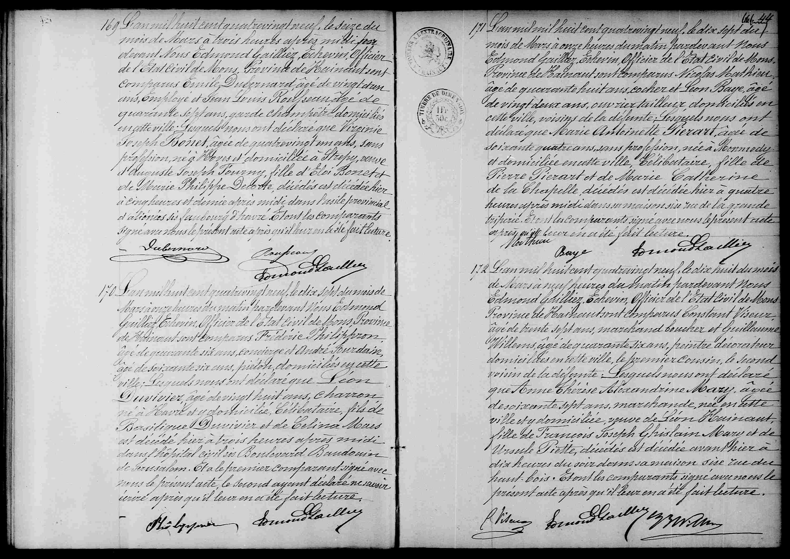

# Décès d'Anne Thérèse Alexandrine Mary (1889)

n° 172 

L'an mil huit cent quatre-vingt-neuf, le dix-huit du mois de mars à neuf heures du matin, pardevant nous Edmond Gailliez, Échevin, Officier de l'État civil de Mons, Province de Hainaut, sont comparus Constant Viseur, âgé de trente-sept ans, marchand boucher et Guillaume Willems, âgé de quarante-six ans, peintre décorateur, domiciliés en cette ville, le premier cousin, le second voisin de la défunte; lesquels nous ont déclaré que **Anne Thérèse Alexandrine Mary**, âgée de soixante-sept ans, marchande, née en cette ville et y domiciliée, **veuve de Léon Hainaut**, fille de François Joseph Ghislain Mary et de Ursule Piette, décédés, est décédée avant-hier à dix heures du soir dans sa maison sise rue du Haut-Bois. Et ont les comparants signé avec nous le présent acte après qu'il leur en a été fait lecture."

---

### Tableau récapitulatif : Acte n° 172 (Décès d'Anne Thérèse Alexandrine Mary)

| Nom | Rôle dans l'acte | Occupation / Notes |
| :--- | :--- | :--- |
| **Anne Thérèse Alexandrine Mary** | Défunte | 67 ans, marchande, veuve de Léon Hainaut |
| François Joseph Ghislain Mary | Père | Décédé |
| Ursule Piette | Mère | Décédée |
| Léon Hainaut | Époux | Décédé |
| Constant Viseur | Déclarant | 37 ans, marchand boucher, cousin de la défunte |
| Guillaume Willems | Déclarant | 46 ans, peintre décorateur, voisin |

---

### Analyse des autres actes sur l'image

| N° Acte | Nom principal | Type d'acte | Notes |
| :--- | :--- | :--- | :--- |
| 171 | Marie Louise Ghislaine Dubois | Décès | 62 ans, née à Mons, domiciliée rue de la Clef. |
| 173 | Victor Joseph Ghislain Dujardin | Décès | 53 ans, charcutier, né à Mons, domicilié rue de la Chaussée. |